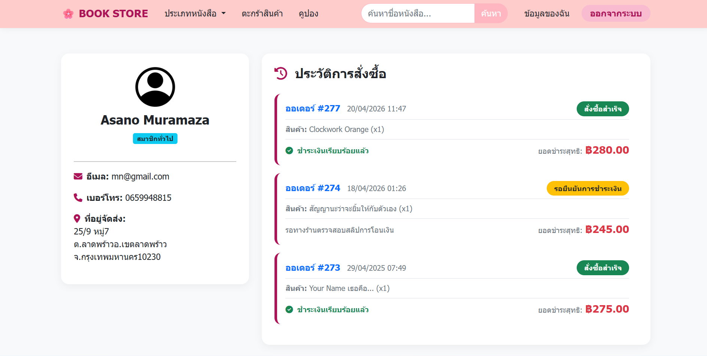
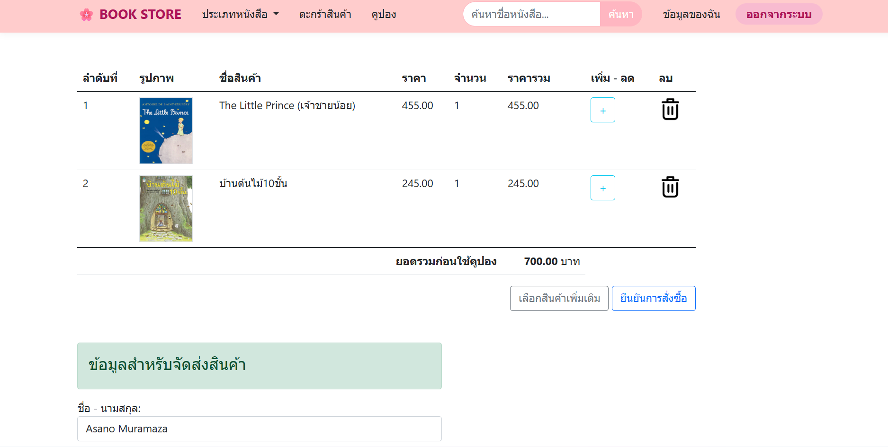
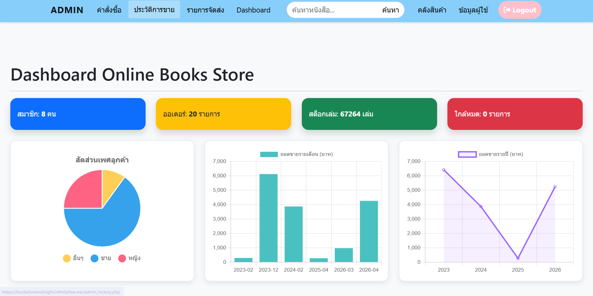

# 📚 Books Store Online

A full-stack e-commerce web application for an online bookstore, developed using PHP and MySQL.  
This project includes both customer-side shopping features and an admin management dashboard.

---

## 📷 Screenshots

---
## 🚀 Features

### 👤 User Side
- User registration and login system
- Browse and search books
- Book details page
- Add to cart / remove from cart
- Apply discount coupons
- Checkout system
- Order tracking

### 🛠️ Admin Side
- Dashboard overview
- Manage books (CRUD)
- Manage users
- Manage orders
- Manage coupons / promotions
- Shipping management

---

## 💻 Tech Stack

- PHP
- MySQL
- HTML5
- CSS3
- JavaScript
- Bootstrap

---

## 🌐 Live Demo

🔗 https://bookstoremidnight.infinityfree.me/

---

## 🔑 Demo Accounts

### User Account
Username: `user`  
Password: `123`

### Admin Account
Username: `admin`  
Password: `123`

---

## 📷 Screenshots

### Homepage

### Book Detail

### Shopping Cart

### Admin Dashboard

---

👨‍💻 Author

Teerapong Homchuen
Frontend / Web Developer
